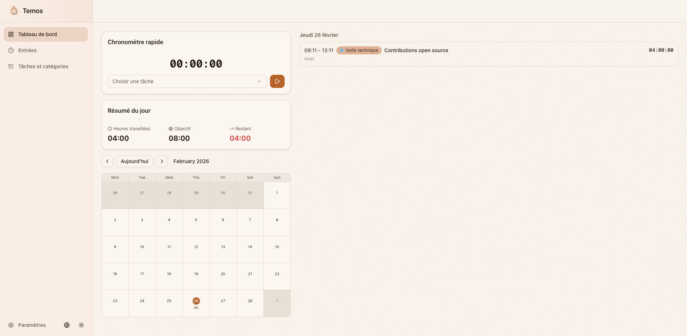

# Temos

A personal time tracking app inspired by [Tyme](https://www.tyme-app.com/en/), but much simpler. All data is stored locally in the browser — no account, no server, no tracking.



## Features

### Time entries
- Create, edit and delete time entries with start/end times, category, and description
- Browse all entries with filters by date range and category
- Entries are grouped by day for easy scanning

### Quick timer
- One-click stopwatch that automatically creates a time entry when stopped
- Pick a category before starting so the entry is ready to save
- Timer persists across page navigation

### Calendar
- Monthly and weekly views with color-coded blocks per category
- Navigate between months with arrow buttons or jump to today
- Visual overview of how time is distributed across the week

### Categories
- Organize entries by category, each with a custom color and icon
- Pastel color palette designed for readability in both light and dark themes
- Create, rename, recolor or delete categories at any time

### Work schedule
- Define target hours per day and mark rest days
- Dashboard shows daily progress: worked, remaining, and overtime
- Adapt the schedule to your own rhythm

### Data export & import
- Export all data (entries, categories, settings) as a single JSON file
- Import a previously exported file to restore or migrate data
- No lock-in: your data is always yours

### Theme & language
- Light, dark, or system theme (syncs with OS preference)
- English and French, auto-detected from browser on first visit
- Switch at any time from the settings page

### Responsive
- Works on desktop, tablet, and mobile
- Sidebar collapses into a bottom navigation on small screens

## Getting started

```bash
# Install dependencies
npm install

# Start the dev server
npm run dev
```

Then open [http://localhost:3000](http://localhost:3000).

## Scripts

| Command | Description |
|---|---|
| `npm run dev` | Start the development server with Turbopack |
| `npm run build` | Create an optimized production build |
| `npm run start` | Serve the production build locally |
| `npm run lint` | Run ESLint on the codebase |
| `npx vitest run` | Run all tests once |
| `npx vitest` | Run tests in watch mode |

## License

This project is licensed under the [MIT License](LICENSE).
